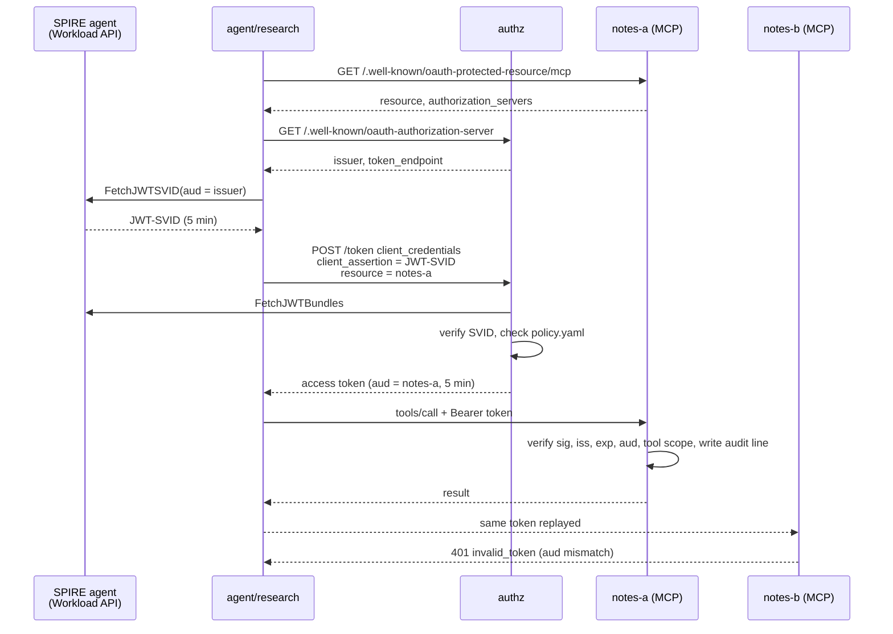

# mcp-svid-auth

Proof of concept. An AI agent authenticates to MCP servers with its SPIFFE workload identity instead of a static API key.

Documentation: https://tanya-ok.github.io/mcp-svid-auth/

## Problem

MCP client configs often hold long-lived static keys:

```json
{ "env": { "NOTES_API_KEY": "sk-live-..." } }
```

| Issue with static keys | Effect |
|---|---|
| Long-lived | A leaked key works until someone rotates it by hand |
| Not bound to a workload | Any process that reads the file can use it |
| Not bound to a server | One key often opens several servers |
| No per-caller identity | Audit logs cannot say which agent acted |

## What this POC shows

| Claim | Where |
|---|---|
| An agent gets a short-lived access token using only its JWT-SVID | `authz.py`, [draft-ietf-oauth-spiffe-client-auth](https://datatracker.ietf.org/doc/draft-ietf-oauth-spiffe-client-auth/) |
| Tokens are bound to one MCP server via the RFC 8707 `resource` parameter | `authz.py`, `policy.py` |
| A token issued for server A is rejected by server B | `mcp_server.py`, `test_token_for_a_is_rejected_by_b` |
| Scopes are enforced per tool, with a 403 `insufficient_scope` challenge. Tools without a declared scope are denied. | `ToolScopeGuard`, `build_mcp` |
| Every decision is written as one hash-chained JSON audit line with the SPIFFE ID; `mcp-svid-audit-verify` detects edits | `audit.py` |
| The MCP server never forwards the incoming token | `mcp_server.py` makes no outbound call with it |
| A stdio MCP server can start with a refreshed short-lived token instead of a static key | `stdio_wrapper.py` |

Targets the [MCP authorization spec, revision 2026-07-28](https://modelcontextprotocol.io/specification/2026-07-28/basic/authorization) (the current revision as of 2026-09-26): Protected Resource Metadata (RFC 9728), resource indicators (RFC 8707), audience validation, no token passthrough.

Client authentication follows [draft-ietf-oauth-spiffe-client-auth-02](https://datatracker.ietf.org/doc/draft-ietf-oauth-spiffe-client-auth/): assertion type `urn:ietf:params:oauth:client-assertion-type:jwt-spiffe`, advertised as `spiffe_jwt` in `token_endpoint_auth_methods_supported` (section on authorization server metadata, checked against the -02 text).

## Architecture



## Components

| Module | Command | Role |
|---|---|---|
| `authz` | `mcp-svid-authz` | Token endpoint. JWT-SVID client assertion in, audience-bound JWT access token out. Publishes JWKS and RFC 8414 metadata. |
| `mcp_server` | `mcp-svid-notes` | MCP server over Streamable HTTP. Tools `notes.search` (`notes:read`) and `notes.write` (`notes:write`). |
| `agent_client` | `mcp-svid-agent` | Discovers the authorization server, refuses it unless it is on the `--trusted-issuer` allowlist, fetches its SVID, gets a token, calls tools. `--steal-token` replays a token against another server. |
| `stdio_wrapper` | `mcp-svid-stdio` | Starts a local stdio MCP server with `MCP_ACCESS_TOKEN_FILE` (0600, refreshed). Fails closed on expiry. `--export-token-env` also sets `MCP_ACCESS_TOKEN` (weaker, see below). |
| `deploy/` | `make demo` | SPIRE server and agent 1.15.3 (pinned by digest), registration entries, the three services, four scenarios. |

Token request, as sent by the agent:

| Parameter | Value |
|---|---|
| `grant_type` | `client_credentials` |
| `client_assertion_type` | `urn:ietf:params:oauth:client-assertion-type:jwt-spiffe` |
| `client_assertion` | JWT-SVID, `aud` = authz issuer only, `iat` required, `exp - iat` at most 300s (`--max-svid-lifetime`) |
| `client_id` | the SPIFFE ID (optional, must match the SVID `sub`) |
| `resource` | canonical URI of the MCP server (required) |
| `scope` | required, single-space separated, must be a subset of the policy grant |

Repeated parameters are rejected with `invalid_request`. Error descriptions are fixed strings; exception details go to the audit log only.

The MCP server accepts only access tokens with header `typ` `at+jwt`, algorithm ES256, and claims `iss`, `sub`, `aud`, `exp`, `iat`, `scope`. Request bodies are capped at 1 MiB (413). Bodies that are not valid JSON-RPC get 400.

## Quickstart

Requires Python 3.12+ and [uv](https://docs.astral.sh/uv/).

```sh
uv sync
make check      # ruff, mypy strict, pytest (offline, no SPIRE needed)
make demo       # needs a running Docker daemon
make down
```

Offline tests use a local key as a stand-in for SPIRE (`LocalSvidIssuer`). `mcp-svid-authz --static-jwks` accepts a JWKS file for the same purpose.

Optional local anonymization denylist: put one term per line in `tests/denylist.txt` (git-ignored). `tests/test_no_identifiers.py` then fails on any match in the tree or history.

## Demo scenarios

| # | Caller | Target | Expected |
|---|---|---|---|
| 1 | `agent/research` | notes-a | token with `notes:read notes:write`, both tools allowed |
| 2 | `agent/research` | notes-b | token with `notes:read`, `notes.write` gets 403 `insufficient_scope` |
| 3 | `agent/intruder` | notes-a | valid SVID, not in `policy.yaml`, token request fails with `unauthorized_client` |
| 4 | `agent/research` | token for notes-a sent to notes-b | 401 `invalid_token`, audit reason `InvalidAudienceError` |

Audit line example:

```json
{"record_id":"5f0c9a53-2a8e-4d0b-9a57-0f3e2f6d1c44","parent_record_id":"b1d7e0a2-6c1f-4e89-8f0e-2d4c7a9b3e51","prev_hash":"3b9f0c2e8d7a41f6b5e0c9d8a7f6e5d4c3b2a1908f7e6d5c4b3a29180f7e6d5c","timestamp":"2026-09-26T18:07:11.742+00:00","component":"mcp_server:notes-b","spiffe_id":"spiffe://example.org/agent/research","tool":"notes.write","decision":"deny","reason":"insufficient_scope: needs notes:write"}
```

Denials before the signature check prefix the SPIFFE ID with `unverified:`.

## Threat model notes

| Threat | Mitigation here | Gap |
|---|---|---|
| Static key leak | No static keys. SVID and access token both live 5 min. | A stolen access token works until expiry. |
| Token replay to another server | `aud` bound to one resource. Each server checks `aud` equals its own URI. | None within one issuer. |
| JWT-SVID replay to authz | SVID `aud` must be the issuer only. 5 min TTL. Default `--svid-replay reject`: `jti` required, each `(sub, jti)` accepted once. | The compose demo runs `allow-reuse-within-lifetime` because the SPIRE 1.15.3 agent re-serves cached SVIDs; there a stolen SVID mints tokens until it expires. See [docs/security.md](docs/security.md#jwt-svid-replay-tracking). |
| SVID harvesting by a malicious resource | The agent mints SVIDs only for issuers on its `--trusted-issuer` allowlist. An issuer named in Protected Resource Metadata that is not on the list is refused, and logged as `issuer_refused`, before any request to it and before any SVID fetch. Exact match after scheme, host and default port normalization; no prefix match. | The allowlist is per process, not per resource. |
| Discovery SSRF | Every URL the agent fetches or sends a credential to (resource, issuer, `token_endpoint`, tool call) must be `https` and resolve only to public addresses. Refused URLs are logged as `url_refused` and get no request. | `--allow-http` and `--allow-private-network` turn the checks off for dev; the compose demo needs both. The check resolves the host itself and the HTTP client resolves it again, so DNS rebinding between the two lookups is not covered. |
| Workload impersonation | SPIRE docker attestor. Identity is bound to a container label, not a UID. | Anyone who can start a container with a registered label on that host gets that identity. |
| Over-broad access | Allowlist per SPIFFE ID, resource and scope. Per-tool scope check. | Policy is a local file. No versioning or review flow. |
| Confused deputy | Server never forwards the incoming token. | No delegation chain for downstream calls. |
| Algorithm confusion | SVIDs: asymmetric algorithms only, `alg=none` rejected. Access tokens: ES256 only, `typ` `at+jwt`. Key selected by `kid` from a trusted key set. | |
| Stale token in a stdio child | Token passed by 0600 file, refreshed. Wrapper deletes it and stops the child on expiry. | `--export-token-env` values are visible in the process environment and never refreshed. |
| Supply chain | Dependency majors bounded, images pinned by digest, `uv.lock` committed. | `httpx2` is a transitive dependency of `mcp` 2.x. On PyPI it is owned by Pydantic Services Inc., source github.com/pydantic/httpx2, uploaded via Trusted Publishing (checked 2026-09-26). |

## Non-goals

- Not production software. No HA, no rotation of the authz signing key, no rate limits, plain HTTP inside the compose network.
- Not a replacement for an MCP gateway such as agentgateway. It shows the token flow a gateway could implement.
- No user delegation. The agent acts as itself (`client_credentials`). No token exchange or `act` claim chain yet.
- No X.509-SVID or WIT-SVID client authentication. JWT-SVID only.
- The compose stack uses the docker attestor with label selectors, a shared PID namespace and the Docker socket mounted into the SPIRE agent. It fits a single-host demo only. See [docs/security.md](docs/security.md#docker-socket-exposure).
- No `jti` replay tracking for access tokens.
- The compose demo accepts JWT-SVID reuse within the SVID lifetime (`--svid-replay=allow-reuse-within-lifetime`). The SPIRE 1.15.3 agent returns the same cached SVID, with the same `jti`, on every fetch.

## Status

| Item | State |
|---|---|
| Offline tests | Pass (`make check`) |
| `make demo` against SPIRE 1.15.3 | Pass on 2026-09-27 with the docker workload attestor (label selectors), `--trusted-issuer`, and `--svid-replay=allow-reuse-within-lifetime`, Docker Desktop 29.6.1 on macOS, cgroup v2. All four scenarios behave as in the table above. A container with an unregistered label, or none, gets `PERMISSION_DENIED` from the Workload API. |
| `--svid-replay reject` against SPIRE 1.15.3 | Not usable yet. The agent re-serves a cached SVID with the same `jti`, so the second token request from a workload gets `client assertion replayed` (tested 2026-09-27). Default stays `reject`; the demo opts out explicitly. |
| stdio wrapper | Minimal. Children must re-read `MCP_ACCESS_TOKEN_FILE` per upstream call. |

## License

Apache-2.0. See [LICENSE](LICENSE) and [NOTICE](NOTICE).
