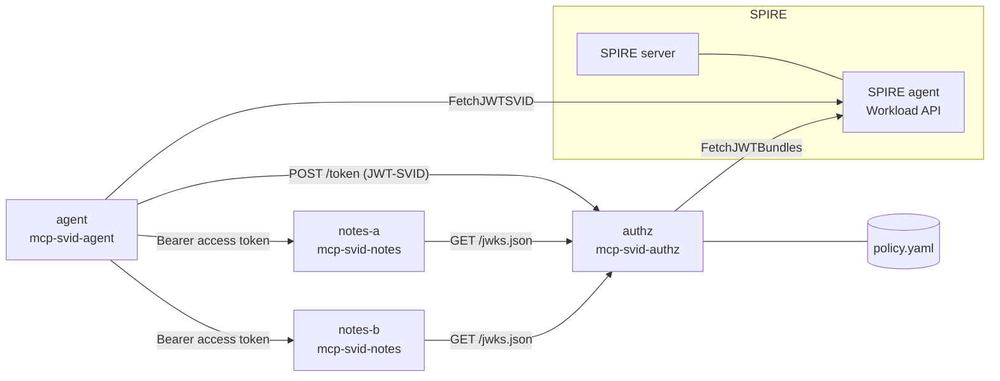
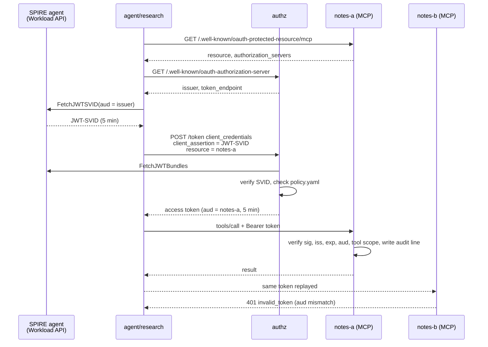

# Architecture

## Components



| Module | Command | Role |
|---|---|---|
| `authz` | `mcp-svid-authz` | Token endpoint. JWT-SVID client assertion in, audience-bound JWT access token out. Publishes JWKS and RFC 8414 metadata. |
| `mcp_server` | `mcp-svid-notes` | MCP server over Streamable HTTP. Tools `notes.search` (`notes:read`) and `notes.write` (`notes:write`). |
| `agent_client` | `mcp-svid-agent` | Discovers the authorization server, fetches its SVID, gets a token, calls tools. `--steal-token` replays a token against another server. |
| `stdio_wrapper` | `mcp-svid-stdio` | Starts a local stdio MCP server with a refreshed token file. See [stdio wrapper](stdio-wrapper.md). |
| `policy` | none | Allowlist of SPIFFE ID, resource and scopes. |
| `audit` | none | One JSON line per decision, to a file or stderr. |
| `spiffe_keys` | none | JWT-SVID source and key resolver: Workload API, or a static JWKS for tests. |
| `deploy/` | `make demo` | SPIRE server and agent 1.15.3, registration entries, the three services, four scenarios. |

## Endpoints

| Service | Path | Method | Content |
|---|---|---|---|
| authz | `/.well-known/oauth-authorization-server` | GET | `issuer`, `token_endpoint`, `jwks_uri`, `grant_types_supported` = `client_credentials`, `token_endpoint_auth_methods_supported` = `spiffe_jwt` |
| authz | `/token` | POST | Token request, form encoded |
| authz | `/jwks.json` | GET | Public ES256 key for access tokens |
| MCP server | `/.well-known/oauth-protected-resource<path>` | GET | `resource`, `authorization_servers`, `scopes_supported`, `bearer_methods_supported` = `header` |
| MCP server | resource path, e.g. `/mcp` | POST | MCP Streamable HTTP, bearer token required |

## Token flow



Steps on the agent side (`agent_client.fetch_access_token`):

1. Read Protected Resource Metadata. Fail if its `resource` differs from the requested one.
2. Read authorization server metadata from the first entry of `authorization_servers`. Fail if its `issuer` differs.
3. Fetch a JWT-SVID with `aud` = issuer.
4. Send a `client_credentials` grant with the SVID as client assertion and `resource` = the server URI.
5. Call tools with the access token as a bearer token.

## Token request

| Parameter | Value |
|---|---|
| `grant_type` | `client_credentials` |
| `client_assertion_type` | `urn:ietf:params:oauth:client-assertion-type:jwt-spiffe` |
| `client_assertion` | JWT-SVID, `aud` = authz issuer only, `iat` required, `exp - iat` at most 300s (`--max-svid-lifetime`) |
| `client_id` | the SPIFFE ID (optional, must match the SVID `sub`) |
| `resource` | canonical URI of the MCP server (required) |
| `scope` | required, single-space separated, must be a subset of the policy grant |

Repeated parameters are rejected with `invalid_request`. Error descriptions are fixed strings. Exception details go to the audit log only. Responses carry `Cache-Control: no-store`.

## Access token

JWT, header `typ` `at+jwt`, `alg` ES256, `kid` of the authz signing key.

| Claim | Value |
|---|---|
| `iss` | authz issuer |
| `sub`, `client_id` | caller SPIFFE ID |
| `aud` | the requested `resource`, trailing slash removed |
| `scope` | granted scopes, sorted, space separated |
| `iat`, `exp` | issue time, issue time + 300s |
| `jti` | random hex |

The authz signing key is a P-256 key generated in memory at start. It rotates only on restart.

## Audit log

Every allow and deny decision in authz and the MCP servers is one JSON line:

```json
{"timestamp":"2026-09-26T18:07:11.742+00:00","component":"mcp_server:notes-a","spiffe_id":"spiffe://example.org/agent/research","tool":"notes.write","decision":"deny","reason":"insufficient_scope: needs notes:write"}
```

| Field | Content |
|---|---|
| `component` | `authz` or `mcp_server:<name>` |
| `spiffe_id` | caller, prefixed with `unverified:` when the decision was made before the signature check, `null` when unknown |
| `tool` | tool name for `tools/call`, else `null` |
| `decision` | `allow` or `deny` |
| `reason` | OAuth error code and fixed description, plus audit-only detail |

Without `--audit-log` the lines go to stderr.
