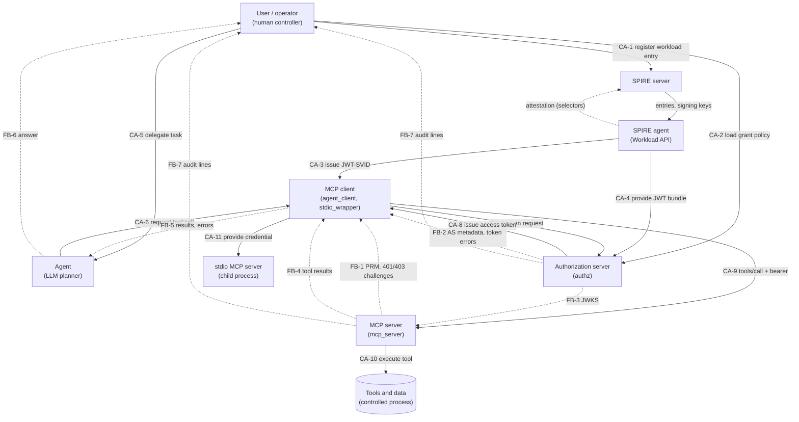

# Threat model (STPA-Sec)

This page analyses agent identity for MCP with STPA-Sec: the security application of System-Theoretic Process Analysis. It follows the four steps of the [STPA Handbook](https://psas.scripts.mit.edu/home/get_file.php?name=STPA_handbook.pdf) (Leveson and Thomas, MIT PSAS, 2018): define losses and hazards, model the control structure, identify unsafe control actions, identify loss scenarios. The security framing follows Young and Leveson, [An integrated approach to safety and security based on systems theory](https://doi.org/10.1145/2556938) (CACM 57(2), 2014).

Clauses are cited from the [MCP authorization spec, revision 2026-07-28](https://modelcontextprotocol.io/specification/2026-07-28/basic/authorization), its [Security Considerations](https://modelcontextprotocol.io/specification/2026-07-28/basic/authorization/security-considerations), [Authorization Server Discovery](https://modelcontextprotocol.io/specification/2026-07-28/basic/authorization/authorization-server-discovery) and [Client Registration](https://modelcontextprotocol.io/specification/2026-07-28/basic/authorization/client-registration) pages, the [Security Best Practices](https://modelcontextprotocol.io/docs/2026-07-28/tutorials/security/security_best_practices), and [draft-ietf-oauth-spiffe-client-auth-02](https://datatracker.ietf.org/doc/draft-ietf-oauth-spiffe-client-auth/). All checked on 2026-09-27.

Scope: the components in [Architecture](architecture.md). The table-level view of threats and known gaps stays in [Security model](security.md); this page derives them from the control structure.

## 1. Losses and hazards

### Losses

| ID | Loss |
|---|---|
| L-1 | Data behind an MCP server is disclosed to a party not entitled to it. |
| L-2 | Data behind an MCP server is changed, or an action is taken, without entitlement or intent. |
| L-3 | An action cannot be attributed to the workload that took it. |
| L-4 | Legitimate agent work cannot run (loss of availability). |

### System-level hazards

| ID | Hazard | Losses |
|---|---|---|
| H-1 | An MCP server executes a tool call for a principal that is not authorized for that tool on that server. | L-1, L-2 |
| H-2 | A credential usable at an MCP server or authorization server is held by a party other than the workload it was issued to. | L-1, L-2, L-3 |
| H-3 | A credential is valid for more resources, scopes or time than the task needs. | L-1, L-2 |
| H-4 | A decision is recorded without, or with the wrong, verified workload identity. | L-3 |
| H-5 | A legitimate workload cannot obtain or use a credential for authorized work. | L-4 |
| H-6 | The MCP client trusts an authorization server or MCP server it was not configured to trust. | L-1, L-2 |
| H-7 | An authorized workload performs a tool call its user did not intend. | L-2 |

H-5 is kept on purpose. Every fail-closed mechanism in this repository trades H-1 to H-3 for H-5, and the trade should be explicit.

## 2. Control structure

Controllers are boxes with a role label. Solid arrows are control actions (CA). Dashed arrows are feedback (FB).

| Controller | Controlled process | Process model it relies on |
|---|---|---|
| User / operator | SPIRE entries, `policy.yaml`, the agent's task | Which workload runs where, which task needs which server and scope |
| Agent | Tool selection | Task text and tool results, both untrusted input for security decisions |
| MCP client | Credential lifecycle for one resource | PRM `resource`, AS `issuer`, token expiry |
| SPIRE agent | Identity issuance | Attestation selectors (Docker container label here) |
| Authorization server | Token issuance | SPIRE JWT bundle, grant policy reloaded on SIGHUP or file change |
| MCP server | Tool execution | Cached authz JWKS (60s, one refetch on unknown `kid` at most every 10s), own canonical URI, tool scope map |

## 3. Unsafe control actions

The four STPA types: NP = not provided causes a hazard; P = provided causes a hazard; T = too early, too late or wrong order; D = stopped too soon or applied too long. "n/a" means no hazardous case was found for that type.

| CA | NP | P | T | D |
|---|---|---|---|---|
| CA-1 register workload entry | UCA-1.1 No entry for a legitimate workload [H-5] | UCA-1.2 Entry selectors match processes other than the intended workload (any container that carries the registered label) [H-2]. UCA-1.3 Entry sets a long JWT-SVID TTL [H-3] | UCA-1.4 Entry created before the label namespace or host is under the operator's control [H-2] | UCA-1.5 Entry for a retired workload is kept [H-2, H-3] |
| CA-2 load grant policy | UCA-2.1 Grant missing for a legitimate workload [H-5] | UCA-2.2 Grant broader than any task needs (all scopes, many resources) [H-3]. UCA-2.3 Grant names the wrong SPIFFE ID or trust domain [H-1] | UCA-2.4 Grant revocation takes effect only after already issued tokens expire [H-3] | UCA-2.5 Grant kept after the need ends [H-3] |
| CA-3 issue JWT-SVID | UCA-3.1 Workload API unavailable [H-5] | UCA-3.2 SVID issued to an attacker process that passes attestation [H-2]. UCA-3.3 SVID `aud` is not only the AS issuer, so it can be replayed to another verifier [H-2] | UCA-3.4 SVID requested for an issuer before that issuer is validated [H-6, H-2] | UCA-3.5 SVID lifetime longer than the token request needs [H-2] |
| CA-4 provide JWT bundle | UCA-4.1 Bundle unavailable, AS cannot verify [H-5] | UCA-4.2 Keys from a foreign trust domain are used to verify [H-1] | UCA-4.3 Stale bundle after key rotation [H-5] | UCA-4.4 Removed key kept in the verifier's cache [H-2] |
| CA-5 delegate task | n/a | UCA-5.1 Task text (or content the agent reads) carries injected instructions [H-7] | n/a | UCA-5.2 Agent keeps acting after the user withdraws the task [H-7] |
| CA-6 request tool call | n/a | UCA-6.1 Agent requests a tool or arguments derived from untrusted tool output [H-7] | n/a | n/a |
| CA-7 token request | UCA-7.1 No refresh before expiry [H-5] | UCA-7.2 Request without `resource` or with a broad resource [H-3]. UCA-7.3 Request for more scope than the call needs [H-3]. UCA-7.4 Request sent to an AS named by an untrusted PRM [H-6]. UCA-7.5 Client identifies itself with a Client ID Metadata Document URL and the AS treats it as proof of workload identity [H-2] | UCA-7.6 Request made before PRM `resource` and AS `issuer` are validated [H-6] | n/a |
| CA-8 issue access token | UCA-8.1 AS refuses a valid request [H-5] | UCA-8.2 Token issued on an unverified assertion (`alg=none`, unknown key, foreign trust domain, expired, wrong `aud`, `client_id` mismatch) [H-1, H-2]. UCA-8.3 Token `aud` is not exactly the requested resource [H-3]. UCA-8.4 Token scope exceeds the grant or defaults to all scopes [H-3]. UCA-8.5 Token issued on a replayed SVID [H-2] | UCA-8.6 Token issued after the grant was removed from the file but before a restart [H-3] | UCA-8.7 Token lifetime longer than the task [H-3] |
| CA-9 tools/call + bearer | n/a | UCA-9.1 Token sent to a server other than its audience [H-2]. UCA-9.2 Client sends a token not issued by that server's AS [H-2]. UCA-9.3 Token placed in the URL query [H-2] | UCA-9.4 Expired token sent [H-5] | n/a |
| CA-10 execute tool | UCA-10.1 Valid token refused because the JWKS cache is stale [H-5] | UCA-10.2 Executes with a token for another audience [H-1]. UCA-10.3 Executes with wrong `typ`, `alg` or `iss` [H-1]. UCA-10.4 Executes a tool without a declared scope, or with insufficient scope [H-1]. UCA-10.5 Forwards the incoming token upstream (token passthrough) [H-2]. UCA-10.6 Decision not audited, or audited with an unverified identity [H-4] | UCA-10.7 Scope check runs after dispatch, or on a body the dispatcher parses differently [H-1] | UCA-10.8 Long-running tool keeps executing after the token expires [H-3] |
| CA-11 provide credential to stdio server | UCA-11.1 No credential, child cannot call upstream [H-5] | UCA-11.2 Credential passed through the environment [H-2, H-3]. UCA-11.3 Static long-lived API key passed [H-2, H-3] | UCA-11.4 Child started before a credential exists [H-5] | UCA-11.5 Token file kept, or child kept running, after the credential expires [H-2]. UCA-11.6 Exported environment value kept after expiry [H-2, H-3] |

### Mapping to MCP 2026-07-28 clauses

| Spec clause | Text (short) | UCAs |
|---|---|---|
| [Access Token Privilege Restriction](https://modelcontextprotocol.io/specification/2026-07-28/basic/authorization/security-considerations#access-token-privilege-restriction) | The MCP server "MUST NOT pass through the token it received from the MCP client". | UCA-10.5 |
| [Token Handling](https://modelcontextprotocol.io/specification/2026-07-28/basic/authorization#token-handling) | Servers must validate the audience per RFC 8707; clients must not send tokens other than ones issued by the server's AS. | UCA-9.1, UCA-9.2, UCA-10.2 |
| [Resource Parameter Implementation](https://modelcontextprotocol.io/specification/2026-07-28/basic/authorization#resource-parameter-implementation) | `resource` must be in token requests and use the canonical URI. | UCA-7.2, UCA-8.3 |
| [Protocol Requirements](https://modelcontextprotocol.io/specification/2026-07-28/basic/authorization#protocol-requirements) | stdio implementations "SHOULD NOT follow this specification, and instead retrieve credentials from the environment". | UCA-11.2, UCA-11.3, UCA-11.6 |
| [Client ID Metadata Document Security](https://modelcontextprotocol.io/specification/2026-07-28/basic/authorization/security-considerations#client-id-metadata-document-security) | CIMD "cannot prevent `localhost` URL impersonation by themselves"; AS should consider SSRF; trust policies are optional. | UCA-7.5 |
| [Authorization Server Discovery](https://modelcontextprotocol.io/specification/2026-07-28/basic/authorization/authorization-server-discovery#authorization-server-metadata-discovery) | The metadata `issuer` must equal the issuer used to build the well-known URL. AS selection among `authorization_servers` is the client's responsibility. | UCA-7.4, UCA-7.6, UCA-3.4 |
| [Token Theft](https://modelcontextprotocol.io/specification/2026-07-28/basic/authorization/security-considerations#token-theft) | AS "SHOULD issue short-lived access tokens". | UCA-8.7, UCA-3.5 |
| [Scope Selection Strategy](https://modelcontextprotocol.io/specification/2026-07-28/basic/authorization#scope-selection-strategy), [Scope Minimization](https://modelcontextprotocol.io/docs/2026-07-28/tutorials/security/security_best_practices#scope-minimization) | Least privilege; 403 `insufficient_scope` with `scope` and `resource_metadata`. | UCA-7.3, UCA-8.4, UCA-10.4 |
| [Access Token Usage](https://modelcontextprotocol.io/specification/2026-07-28/basic/authorization#token-requirements) | Tokens must not be in the URI query string. | UCA-9.3 |
| [SSRF](https://modelcontextprotocol.io/docs/2026-07-28/tutorials/security/security_best_practices#server-side-request-forgery-ssrf) | Clients fetch `resource_metadata`, `authorization_servers` and `token_endpoint` from possibly malicious servers. | UCA-7.4 |
| draft-ietf-oauth-spiffe-client-auth-02, section 3 | The JWT-SVID `aud` contains "only the issuer identifier of the authorization server as its sole value". | UCA-3.3, UCA-8.2 |

## 4. Loss scenarios

Scenarios of type A explain why a controller provides a UCA (flawed process model, flawed feedback, adversarial input). Type B explain why a correct control action is not followed.

| ID | Type | Scenario | UCAs | Losses |
|---|---|---|---|---|
| LS-1 | A, adversarial | Anyone who can start containers on the host starts one with the label `org.example.svid.workload=agent-research`. The docker attestor cannot tell it apart, so the SPIRE agent issues it the agent's SVID. It then gets tokens within the agent's full grant. A process that controls the SPIRE agent container also controls the Docker daemon through the mounted socket. | UCA-1.2, UCA-3.2 | L-1, L-2, L-3 |
| LS-2 | B, adversarial | An attacker reads an access token from a log or memory and sends it to a second MCP server of the same issuer. | UCA-9.1 | L-1 |
| LS-3 | A, adversarial | A compromised MCP server publishes PRM that names an attacker AS. Without an issuer allowlist the client would fetch an SVID for the attacker issuer and send it there; the SVID cannot be replayed to the honest AS (`aud` mismatch), but the client would trust tokens and errors from the attacker AS. With `--trusted-issuer` the client refuses before any request to that AS. The PRM fetch, the `token_endpoint` and the tool call URL must be `https` and resolve to public addresses, so a malicious PRM or AS metadata document cannot point the client at internal services; DNS rebinding between the check and the fetch remains. | UCA-7.4, UCA-3.4 | L-1, L-2 |
| LS-4 | A, adversarial | An intermediate MCP server that needs an upstream API forwards the caller's token. The upstream accepts it, and its logs show the caller, not the server. Here the relay uses its own token and the upstream rejects a forwarded one (`aud` mismatch); the upstream audit then names the relay, and which caller it acted for is lost until a delegation chain exists. | UCA-10.5 | L-1, L-3 |
| LS-5 | A, adversarial | A local stdio server is launched with an API key in its environment. Any process under the same UID reads it from the process environment; grandchildren inherit it; it never expires. | UCA-11.2, UCA-11.3 | L-1, L-2 |
| LS-6 | A, adversarial | A client presents a well-known client's CIMD URL as `client_id` and a `localhost` redirect. The AS shows the legitimate client name. The document proves domain control, not which process holds the redirect. | UCA-7.5 | L-1, L-2 |
| LS-7 | A, adversarial | A tool result contains instructions. The agent follows them and calls `notes.write` with attacker content. Every check passes: the workload is authorized, only its intent is wrong. | UCA-5.1, UCA-6.1 | L-2 |
| LS-8 | A | The operator removes a grant from `policy.yaml`. authz reloads the file on SIGHUP or within `--policy-poll-seconds` (5s), and denies new token requests from then on. Tokens issued before the reload stay valid for up to 5 minutes, because there is no revocation list or introspection. | UCA-2.4, UCA-8.6 | L-1, L-2 |
| LS-9 | A, adversarial | A JWT-SVID is stolen within its 5-minute lifetime and replayed at the token endpoint. In `--svid-replay reject` mode each `(sub, jti)` is accepted once, so only an unused SVID works, once. In `allow-reuse-within-lifetime` mode, which the compose demo needs because the SPIRE 1.15.3 agent re-serves cached SVIDs, each replay mints a fresh token until the SVID expires. | UCA-8.5 | L-1, L-2 |
| LS-10 | B | authz restarts with a new signing key. MCP servers cache the old JWKS for up to 60 seconds. An unknown `kid` triggers one refetch, at most every 10 seconds, so tokens with the new key are refused for at most 10 seconds. | UCA-10.1 | L-4 |
| LS-11 | A | The Workload API or the token endpoint is unreachable during refresh. The stdio wrapper cannot renew, so it deletes the token and stops the child. | UCA-7.1, UCA-11.5 | L-4 (accepted) |
| LS-12 | A | A body with a tool name the scope guard does not recognize, or JSON the guard and the SDK parse differently, reaches dispatch without a scope decision. | UCA-10.7, UCA-10.4 | L-1, L-2 |

## 5. Mitigations in this repository

Links go to the source on `main`. "Not mitigated" names the matching non-goal or known gap from [Security model](security.md).

| UCA | Status | Mechanism | Evidence |
|---|---|---|---|
| UCA-1.1, 2.1, 3.1, 4.1, 8.1, 11.1 | Accepted (fail closed) | Missing identity, grant or bundle gives a fixed-string error, never a fallback credential | [`test_bundle_lookup_failure_is_503_without_detail`](https://github.com/tanya-ok/mcp-svid-auth/blob/main/tests/test_authz_hardening.py), [`test_cleanup_when_first_fetch_fails`](https://github.com/tanya-ok/mcp-svid-auth/blob/main/tests/test_stdio_wrapper.py) |
| UCA-1.2, 3.2 | Partly | docker attestor binds identity to a container label, not a UID. Anyone who can start containers on the host can set any label, and the SPIRE agent holds the Docker socket | Demo: an unregistered or missing label gets `PERMISSION_DENIED`; demo scenario 5 shows a second container with the label getting the identity; [`deploy/spire/agent.conf`](https://github.com/tanya-ok/mcp-svid-auth/blob/main/deploy/spire/agent.conf). Known gaps "Label selectors" and "Docker socket in the SPIRE agent" |
| UCA-1.3, 3.5 | Mitigated | authz rejects SVIDs with `exp - iat` above `--max-svid-lifetime` (300s) and SVIDs without `iat` | [`authz.py`](https://github.com/tanya-ok/mcp-svid-auth/blob/main/src/mcp_svid_auth/authz.py), [`test_svid_lifetime_above_max_rejected`, `test_svid_without_iat_rejected`](https://github.com/tanya-ok/mcp-svid-auth/blob/main/tests/test_authz_hardening.py) |
| UCA-1.4, 1.5, 2.5 | Not mitigated | Operator process. Entries and policy have no review or expiry flow | Known gap "Over-broad access: policy is a local file" |
| UCA-2.2 | Partly | Per SPIFFE ID, per resource, per scope allowlist. Breadth is the operator's choice | [`policy.py`](https://github.com/tanya-ok/mcp-svid-auth/blob/main/src/mcp_svid_auth/policy.py), [`test_resource_not_allowed_for_client`](https://github.com/tanya-ok/mcp-svid-auth/blob/main/tests/test_authz.py) |
| UCA-2.3 | Mitigated | Trust domain pinned in policy; SPIFFE ID must be allowlisted | [`test_foreign_trust_domain`, `test_spiffe_id_not_allowlisted`](https://github.com/tanya-ok/mcp-svid-auth/blob/main/tests/test_authz.py), demo scenario 3 |
| UCA-2.4, 8.6 | Partly | Policy reloaded on SIGHUP and on content change (polled every 5s). New token requests are denied from the reload on; an invalid file denies all. Already issued tokens stay valid until `exp` (at most 300s); no revocation list or introspection | [`test_removed_grant_denies_new_tokens`, `test_invalid_file_fails_closed_until_fixed`, `test_sighup_forces_reload`](https://github.com/tanya-ok/mcp-svid-auth/blob/main/tests/test_policy_reload.py) |
| UCA-3.3 | Mitigated | authz requires SVID `aud` to be exactly its issuer | [`test_wrong_svid_audience`, `test_svid_with_extra_audience_is_rejected`](https://github.com/tanya-ok/mcp-svid-auth/blob/main/tests/test_authz.py) |
| UCA-3.4, 7.4, 7.6 | Mitigated | Required `--trusted-issuer` allowlist on the agent and the stdio wrapper. An issuer not on the list is refused before any request to it and before any SVID fetch; exact match after normalization. Client also checks PRM `resource` and AS metadata `issuer`. Resource, issuer, `token_endpoint` and tool call URLs must be `https` and resolve only to public addresses unless `--allow-http` or `--allow-private-network` is set | [`test_untrusted_issuer_refused_before_svid`, `test_path_issuer_trailing_slash_refused`, `test_agent_cli_requires_trusted_issuer`, `test_stdio_cli_requires_trusted_issuer`](https://github.com/tanya-ok/mcp-svid-auth/blob/main/tests/test_issuer_allowlist.py), [`test_private_resource_refused_before_any_request`, `test_unsafe_token_endpoint_refused_before_svid`, `test_call_tool_refuses_unsafe_url_before_sending_token`](https://github.com/tanya-ok/mcp-svid-auth/blob/main/tests/test_url_policy.py) |
| UCA-4.2 | Mitigated | Key selected by `kid` from the policy trust domain bundle only | [`test_svid_signed_by_unknown_key`, `test_svid_signed_by_wrong_key_with_known_kid`](https://github.com/tanya-ok/mcp-svid-auth/blob/main/tests/test_authz.py) |
| UCA-4.3, 4.4 | Partly | Workload API mode fetches bundles from SPIRE per request; static JWKS mode is test only | [`spiffe_keys.py`](https://github.com/tanya-ok/mcp-svid-auth/blob/main/src/mcp_svid_auth/spiffe_keys.py) |
| UCA-5.1, 5.2, 6.1 | Not mitigated | Identity bounds the blast radius (grant, scope, audience), not intent. `tools/list` filtering hides tools outside the granted scope from the agent, but does not judge intent | Non-goal "No user delegation" |
| UCA-7.1, 11.5 | Mitigated | stdio wrapper refreshes inside `--refresh-margin`, then fails closed: deletes the file, stops the child, exits 75 | [`test_refresher_rewrites_before_expiry`, `test_wrapper_exits_nonzero_when_token_expires`](https://github.com/tanya-ok/mcp-svid-auth/blob/main/tests/test_stdio_wrapper.py) |
| UCA-7.2, 8.3 | Mitigated | `resource` required; token carries exactly one `aud`, trailing slash removed | [`test_missing_resource`, `test_valid_flow_issues_audience_bound_token`](https://github.com/tanya-ok/mcp-svid-auth/blob/main/tests/test_authz.py) |
| UCA-7.3, 8.4 | Mitigated | `scope` required, must be a subset of the grant, no implicit default | [`test_scope_is_required`](https://github.com/tanya-ok/mcp-svid-auth/blob/main/tests/test_authz_hardening.py), [`test_scope_beyond_policy_is_rejected`, `test_requested_scope_is_narrowed`](https://github.com/tanya-ok/mcp-svid-auth/blob/main/tests/test_authz.py) |
| UCA-7.5 | Not applicable | authz accepts only `client_credentials` with the `jwt-spiffe` assertion type. No CIMD, no DCR, no redirect URIs | [`test_protocol_errors`](https://github.com/tanya-ok/mcp-svid-auth/blob/main/tests/test_authz.py) |
| UCA-8.2 | Mitigated | Asymmetric `alg` only, signature, `sub`, `aud`, `exp`, `iat`, `client_id` equals `sub` | [`test_unsigned_assertion_rejected`, `test_expired_svid`, `test_client_id_must_match_svid`](https://github.com/tanya-ok/mcp-svid-auth/blob/main/tests/test_authz.py) |
| UCA-8.5 | Partly | Default `--svid-replay reject`: `jti` required, each `(sub, jti)` accepted once, full cache fails closed. The compose demo runs `allow-reuse-within-lifetime` because the SPIRE 1.15.3 agent re-serves cached SVIDs; reuse is then only visible as `svid_jti` in the audit trail | [`test_replayed_svid_rejected`, `test_missing_jti_rejected`, `test_full_cache_fails_closed`, `test_allow_reuse_accepts_same_svid_and_audits_jti`](https://github.com/tanya-ok/mcp-svid-auth/blob/main/tests/test_authz_replay.py). Known gap "JWT-SVID reuse allowed in the demo" |
| UCA-8.7 | Mitigated | Access tokens live 300s | [`authz.py`](https://github.com/tanya-ok/mcp-svid-auth/blob/main/src/mcp_svid_auth/authz.py), [`test_expired_access_token_rejected`](https://github.com/tanya-ok/mcp-svid-auth/blob/main/tests/test_resource_server.py) |
| UCA-9.1, 10.2 | Mitigated | Server rejects any `aud` other than its canonical URI | [`test_token_for_a_is_rejected_by_b`](https://github.com/tanya-ok/mcp-svid-auth/blob/main/tests/test_end_to_end.py), demo scenario 4 |
| UCA-9.2, 10.3 | Mitigated | `iss` pinned, `typ` `at+jwt`, ES256 only, `kid` from authz JWKS | [`test_token_from_other_issuer_rejected`, `test_access_token_without_at_jwt_typ_rejected`, `test_access_token_algorithm_pinned_to_es256`](https://github.com/tanya-ok/mcp-svid-auth/blob/main/tests/test_resource_server.py) |
| UCA-9.3 | Mitigated | Tokens sent only in the `Authorization` header; PRM advertises `bearer_methods_supported` = `header` | [`agent_client.py`](https://github.com/tanya-ok/mcp-svid-auth/blob/main/src/mcp_svid_auth/agent_client.py), [`test_protected_resource_metadata`](https://github.com/tanya-ok/mcp-svid-auth/blob/main/tests/test_end_to_end.py) |
| UCA-9.4 | Accepted | Expired token gets 401 `invalid_token`; client fetches a new one | [`test_expired_access_token_rejected`](https://github.com/tanya-ok/mcp-svid-auth/blob/main/tests/test_resource_server.py) |
| UCA-10.1 | Mitigated | JWKS fetched asynchronously and cached 60s. Unknown `kid` triggers one refetch, at most every 10s; JWKS URL comes only from `--jwks-uri`; fetch failure fails closed | [`test_unknown_kid_refetches_once_and_accepts_rotated_key`, `test_refetch_is_rate_limited`, `test_fetch_failure_denies_without_raising`](https://github.com/tanya-ok/mcp-svid-auth/blob/main/tests/test_jwks_fetcher.py) |
| UCA-10.4, 10.7 | Mitigated | Scope guard parses the body before dispatch; unknown tools and unparseable bodies get 400; server refuses to start if a tool has no scope; `tools/list` shows only tools whose scope was granted | [`test_unknown_tool_denied`, `test_unparseable_body_rejected`, `test_every_registered_tool_declares_a_scope`, `test_tools_list_filtered_by_scope`](https://github.com/tanya-ok/mcp-svid-auth/blob/main/tests/test_resource_server.py), [`test_scope_enforced_per_tool`](https://github.com/tanya-ok/mcp-svid-auth/blob/main/tests/test_end_to_end.py) |
| UCA-10.5 | Mitigated | Security invariant 3. With `--upstream-resource`, `notes.search_upstream` calls the upstream with a token the server gets with its own JWT-SVID (`Upstream`), never the caller's. A test records every request leaving the server and checks that none carries the caller token; the caller token presented upstream gets 401. No `act` chain, so the upstream sees the server, not the original caller | [`test_upstream_call_never_carries_caller_token`, `test_forwarded_caller_token_is_rejected_upstream`](https://github.com/tanya-ok/mcp-svid-auth/blob/main/tests/test_no_passthrough.py). Non-goal "No token exchange or `act` claim chain yet" |
| UCA-10.6 | Mitigated | One audit line per decision; pre-verification identity prefixed `unverified:`. Lines are hash-chained and `mcp-svid-audit-verify` detects edited, deleted or reordered lines; the chain is not signed or anchored, so deleting lines from the end (tail truncation) is not detected | [`test_authz_audit_lines`](https://github.com/tanya-ok/mcp-svid-auth/blob/main/tests/test_authz.py), [`test_token_for_a_is_rejected_by_b`](https://github.com/tanya-ok/mcp-svid-auth/blob/main/tests/test_end_to_end.py), [`test_edited_record_is_detected`, `test_deleted_record_is_detected`](https://github.com/tanya-ok/mcp-svid-auth/blob/main/tests/test_audit_chain.py) |
| UCA-10.8 | Partly | The scope guard stops waiting for a `tools/call` at the token `exp` and answers 401 `invalid_token` (audit `token_expired_during_call`). A sync tool keeps running on its worker thread, so `notes.write` re-checks expiry right before it changes state and refuses after `exp`. A tool without that re-check can still finish its side effect late | [`test_call_outliving_token_gets_401`, `test_write_refuses_after_expiry_without_side_effect`](https://github.com/tanya-ok/mcp-svid-auth/blob/main/tests/test_token_expiry.py) |
| UCA-11.2, 11.3 | Mitigated (default) | Wrapper passes a 0600 token file, removes inherited `MCP_ACCESS_TOKEN`. This deviates on purpose from the stdio SHOULD in the spec | [`test_token_file_is_owner_only`, `test_child_gets_only_token_file_by_default`](https://github.com/tanya-ok/mcp-svid-auth/blob/main/tests/test_stdio_wrapper.py) |
| UCA-11.4 | Mitigated | Child is not started if the first fetch fails | [`test_cleanup_when_first_fetch_fails`](https://github.com/tanya-ok/mcp-svid-auth/blob/main/tests/test_stdio_wrapper.py) |
| UCA-11.6 | Mitigated (opt in) | With `--export-token-env` the wrapper stops the child when the exported token expires and exits 75; the host restarts it with a fresh token. Detached grandchildren keep the expired value | [`test_env_export_is_opt_in`, `test_env_export_stops_child_when_exported_token_expires`](https://github.com/tanya-ok/mcp-svid-auth/blob/main/tests/test_stdio_wrapper.py), [stdio wrapper](stdio-wrapper.md#-export-token-env) |

### Not mitigated, summary

| UCA | Hazard | Loss scenario | Matching non-goal or gap |
|---|---|---|---|
| UCA-1.2, 3.2 (partly) | H-2 | LS-1 | Label selectors; Docker socket in the SPIRE agent |
| UCA-5.1, 5.2, 6.1 | H-7 | LS-7 | No user delegation |
| UCA-2.4, 8.6 (partly) | H-3 | LS-8 | No revocation of issued tokens; time to denial up to the 300s token TTL |
| UCA-8.5 (partly) | H-2 | LS-9 | JWT-SVID reuse allowed in the demo (SPIRE 1.15.3 agent SVID cache) |
| UCA-10.8 (partly) | H-3 | none listed | Tools without their own expiry re-check can finish a side effect after `exp` |

## 6. Demo scenarios from this analysis

Each item turns a loss scenario into a scripted, repeatable result, next to the four base scenarios in [Demo scenarios](demo.md). All except 10 run in `make demo` (checked 2026-09-27).

| # | Scenario | Result | Covers |
|---|---|---|---|
| 5 | Label impostor: a second container with the `agent-research` label | Gets `agent/research` and a token, and even the same cached SVID. Shows the limit of label selectors; an image digest selector or the k8s attestor would be needed to deny it | LS-1, UCA-3.2 |
| 6 | Malicious PRM: notes-rogue names a rogue AS in `authorization_servers` | Client logs `issuer_refused` and fetches no SVID | LS-3, UCA-7.4 |
| 7 | SVID replay: the same JWT-SVID posted twice to `/token` | Two tokens under `allow-reuse-within-lifetime`, the mode the SPIRE 1.15.3 agent forces; `invalid_client` on the second under `reject` (offline test) | LS-9, UCA-8.5 |
| 8 | Upstream call without passthrough: notes-a calls notes-b with its own token | notes-b audits `mcp/notes-a`; the forwarding variant is scenario 4 (401) | LS-4, UCA-10.5 |
| 9 | Grant revocation: remove a grant during a run | `invalid_target` after the next reload (0.9s and 5.0s in two runs, poll 5s); issued tokens live until `exp` | LS-8, UCA-2.4 |
| 10 | Prompt-injected write: a note tells the agent to call `notes.write` | Not scripted. Out of scope for identity: all checks pass under a read-write grant; `notes:read` only limits the blast radius | LS-7, UCA-5.1 |
| 11 | authz restart: new signing key while servers cache the old JWKS | No 401: the unknown `kid` refetch picks up the new key at once, bounded by the 10s refetch rate limit | LS-10, UCA-10.1 |
